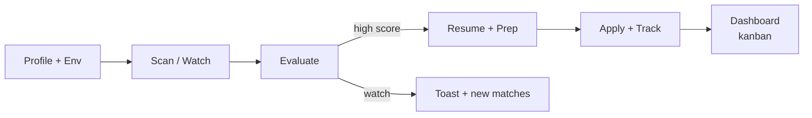

# Hunt-Job — Quick Start Guide

Forgot how to run it? Here are all the ways:

## 🚀 Easiest (Recommended)

### On Windows:

**Option A: Better display (recommended)**
```bash
npm start
```
Or:
```bash
node hunt-job.js
```

**Option B: Classic batch file**
```bash
hunt-job.bat
```
(Note: Windows Command Prompt shows ASCII-only menu. For Unicode/emoji support, use `npm start`)

### On macOS/Linux:
```bash
bash hunt-job.sh
```
Or with execute permissions:
```bash
chmod +x hunt-job.sh
./hunt-job.sh
```

### Universal (All Platforms):
```bash
npm start
```

---

## 🎯 Quick Usage

```bash
npm start                 # interactive menu (recommended)
node hunt-job.js          # same as above

# Or direct:
node hunt-job.js scan --archetype "Backend Engineer"
node hunt-job.js watch --archetype "DevOps Engineer" --interval 30
npm run dashboard         # open http://127.0.0.1:7777
node hunt-job.js detect https://careers.company.com
npm run audit-portals
```

**Multi-provider AI supported** (any of: ANTHROPIC, GEMINI, GROQ, OPENROUTER, NVIDIA). Set keys in `.env`; auto-selects best available.

**Env-based profile** (no prompts): use `HUNT_JOB_NAME`, `HUNT_JOB_EMAIL`, `HUNT_JOB_ROLE`, `HUNT_JOB_ARCHETYPES`, `HUNT_JOB_SALARY_MIN/MAX`, etc. See README.

### Flow


## 🎯 Direct Commands (npm scripts + hunt-job.js)

**npm scripts:**
```bash
npm start
npm run hunt -- --archetype "..."
npm run watch -- --archetype "..."
npm run dashboard
npm run audit-portals
npm run evaluate-job -- "<url>"
npm run scan-portals -- --archetype "..."
npm run generate-resume -- <job-id>
npm run prepare-interview -- "jd.txt"
npm run profile:init
npm run profile:edit
npm run setup
npm run parse-resume -- resume.pdf
```

**Direct (via hunt-job.js):**
```bash
node hunt-job.js scan --archetype "Data Engineer"
node hunt-job.js evaluate "https://..."
node hunt-job.js resume <id>
node hunt-job.js prep "description or file"
node hunt-job.js watch --archetype "SRE" --interval 15 --once
node hunt-job.js dashboard
node hunt-job.js detect <careers-url>
node hunt-job.js audit-portals   # (via npm or direct src/cli/auditPortals.js)
node hunt-job.js profile init
node hunt-job.js profile edit
node hunt-job.js setup
node hunt-job.js hunt --archetype "..."
```

---

## 📋 First-Time Setup

1. **Set your API key** (pick any: Gemini free recommended, Groq, Claude, etc.):
   ```bash
   npm run setup
   # or set GEMINI_API_KEY / GROQ_API_KEY / ANTHROPIC_API_KEY
   ```

2. **Initialize your profile:**
   ```bash
   npm run profile:init
   # OR set HUNT_JOB_* env vars for no-prompt runs
   ```

3. **Start the app:**
   ```bash
   npm start
   # or: node hunt-job.js
   ```

---

## ⚙️ Environment Variables

Create a `.env` file in the project root:

```env
ANTHROPIC_API_KEY=your_api_key_here
CLAUDE_MODEL=claude-3-5-sonnet-20241022
```

Or set them in your terminal:

**Windows (PowerShell):**
```powershell
$env:ANTHROPIC_API_KEY="your_key"
```

**macOS/Linux:**
```bash
export ANTHROPIC_API_KEY="your_key"
```

---

## 🆘 Troubleshooting

**"Node is not found"**
- Install Node.js from https://nodejs.org

**"Module not found"**
- Run: `npm install`

**"API key not working"**
- Run: `npm run setup`
- Or create `.env` with your API key

**Bat file gives "syntax error"**
- Run: `npm start` instead (universal solution)

---

## 📁 What Gets Created

After first run:
- `config/profile.yml` + `modes/_profile.md` — Your profile (keep private!)
- `data/hunt-job.db` — Jobs, evaluations, applications, companies (SQLite; v2 scanner)
- `data/resumes/` — Generated ATS PDFs
- `data/interview-prep/` — Prep guides + YouTube plans
- `data/logs/` — JSONL logs

---

## 🚶 Walkthrough: First Job, Start to Finish

**1. Install**
```bash
node --version          # v16+
git clone https://github.com/rhishi99/hunt-job.git && cd hunt-job
npm install
npm run setup           # set your ANTHROPIC_API_KEY
```

**2. Build your profile** (~3 min)
```bash
npm run profile:init
```
Answer: name/email/phone, current role, years of experience, target
archetypes (e.g. `Backend Engineer`), salary range (lakhs), tech stack
(comma-separated), dealbreakers.

**3. Evaluate a job** (~2 min)
```bash
npm run evaluate-job -- "https://careers.flipkart.com/jobs/backend-engineer"
# or: node hunt-job.js evaluate "..."
```
Outputs a score out of 5 + per-dimension breakdown.

**4. Generate a tailored resume**
```bash
npm run generate-resume -- job_<id>
```

**5. Bonus — interview prep + watch/dashboard**
```bash
npm run prepare-interview -- "Senior Backend Engineer at Flipkart"
npm run watch -- --archetype "Backend Engineer"
npm run dashboard   # http://127.0.0.1:7777
```
Produces focus areas, YouTube + schedule. Use `audit-portals` / `detect` to maintain the SQLite company registry (provider scanner v2).

**Next:** apply on the company portal, save the resume, work the prep
plan, repeat for the next job.

---

## 🆘 More Troubleshooting

**API key error?**
```bash
echo $ANTHROPIC_API_KEY      # verify it's set
npm run setup                # or set it interactively
```

**No PDF generated?**
```bash
npx playwright install
npm run generate-resume -- job_id
```

**Profile not found?**
```bash
npm run profile:init
cat config/profile.yml       # verify it exists
```

---

**Built with ❤️ using Claude & Claude Code**

**SQLite + v2 scanner** (providers: Greenhouse, Lever, Ashby, SmartRecruiters, Recruitee, Workable + JSON-LD). Data in `data/hunt-job.db`.
