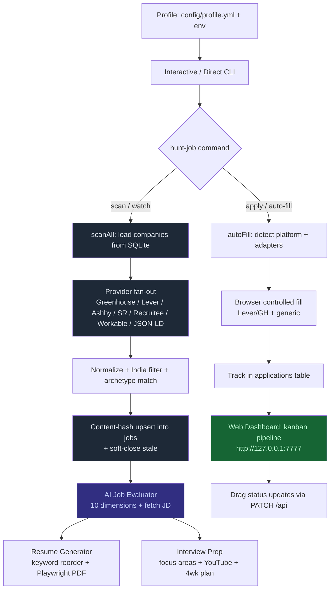

# Hunt-Job — AI-Powered Job Search Agent

> An intelligent multi-agent job search system built on Claude (Extended from Career-Ops). Evaluates jobs across 10 dimensions, generates ATS-optimized resumes tailored per JD, preps you for interviews with YouTube resources, and auto-fills application forms — all India-focused, all local.

---

## 📖 Documentation Quick Start

**Choose your path:**

| I want to... | Read this | Time |
|---|---|---|
| **Get running NOW** | [QUICKSTART.md](QUICKSTART.md) | 10 min |
| **Understand everything** | [SETUP_GUIDE.md](SETUP_GUIDE.md) | 1 hour |
| **Have questions** | [FAQ.md](FAQ.md) | 5 min |
| **See feature comparison** | [COMPARISON.md](COMPARISON.md) | 10 min |
| **Compare with LinkedIn** | [VS_LINKEDIN.md](VS_LINKEDIN.md) | 10 min |

---

## What Makes This Fork Different

| Capability | Original | This Fork |
|---|:---:|:---:|
| Interactive terminal UI | ❌ | ✅ |
| 5 AI providers (Claude, Gemini, Groq, OpenRouter, NVIDIA) | ❌ | ✅ |
| India-only location enforcement | ❌ | ✅ |
| 6 ATS platforms (Greenhouse, Lever, Ashby, SmartRecruiters, Recruitee, Workable) + JSON-LD fallback | ❌ | ✅ |
| One SQLite database — jobs, evaluations, applications, dedup + change detection | ❌ | ✅ |
| `hunt-job watch` — periodic scan + desktop notification on new matches | ❌ | ✅ |
| Local web dashboard (`hunt-job dashboard`, `localhost:7777`) | ❌ | ✅ |
| Interview prep with YouTube + 4-week schedule | ❌ | ✅ |
| Browser auto-fill (form selectors) | ❌ | ✅ |

Full comparison → [COMPARISON.md](COMPARISON.md)

---

## Quick Start

### Prerequisites
- Node.js 16+
- At least one AI provider API key (Anthropic, Gemini, Groq, OpenRouter, NVIDIA)

### Installation

```bash
git clone https://github.com/rhishi99/hunt-job.git
cd hunt-job

npm install
npx playwright install chromium   # for resume PDF + auto-fill

npm run setup        # configure your API key
npm start            # launch interactive menu
```

### Interactive Menu (Recommended)

```bash
npm start
```

Launches terminal UI:
```
┌──────────────────────────────────────────┐
│   🎯  Hunt-Job  —  AI Job Search Agent   │
└──────────────────────────────────────────┘

  🚀  Full Apply Workflow  (eval → prep → resume)
  📊  Evaluate a Job
  🏢  Scan Job Portals  (live)
  🔎  Browse Saved Jobs  (instant)
  🎯  Interview Prep
  📄  Generate Resume
  📋  Application Tracker
  🖥️   Web Dashboard
  👤  Update Profile
```

### Individual Commands

```bash
# Single-command full workflow (scans + evaluates top matches)
npm run hunt -- --archetype "Cloud Engineer" --limit 10

# Evaluate any job posting
npm run evaluate-job -- "https://company.com/jobs/123"

# Scan company ATS boards live (populates the SQLite jobs table)
npm run scan-portals -- --archetype "Cloud Engineer"

# INSTANT offline browse of already-scanned jobs (no network) — same filter flags as scan
npm run list -- --archetype "Cloud Engineer" --new
node hunt-job.js list -a "Data Engineer" --remote --json

# AI auto-fill apply flow — opens a browser, you review & submit
npm run apply -- "https://boards.greenhouse.io/acme/jobs/123"

# Watch for new matches every 30 min + desktop notification (Ctrl+C to stop)
npm run watch -- --archetype "Cloud Engineer"

# Re-verify every company's ATS platform/slug, or a single career page
npm run audit-portals
node hunt-job.js detect https://careers.company.com
# (audit-portals also: node src/cli/auditPortals.js)

# Local web dashboard (pipeline board, job list, timelines) — localhost:7777
npm run dashboard
# Pipeline statuses: scanned, evaluated, applied, interview, offer, rejected (exact from server.js)

# Generate ATS-optimized resume
npm run generate-resume -- job_123

# Generate interview prep with YouTube links
npm run prepare-interview -- "job_description.txt"

# Seed the companies registry with live-verified ATS boards
npm run seed:ats
```

### Filter flags (shared by `scan` and `list`)

Both commands accept the same filters:

```
-a, --archetype <name>     match against your role archetype
-s, --since <days>         only jobs posted within N days
    --new                  only jobs new since the last scan
    --new-hours <h>        only jobs newer than H hours
-n, --limit <n>            cap the number of results
-c, --company <text>       filter by company name
-l, --location <text>      filter by location text
    --remote               remote roles only
    --all, --all-locations drop the India-only location filter
-p, --platform <ats>       filter by ATS platform (greenhouse, lever, ...)
    --json                 machine-readable JSON output
```

**→ Full setup guide:** [SETUP_GUIDE.md](SETUP_GUIDE.md)

---

## Features

**Pipeline Statuses** (exact values from `src/web/server.js` APP_STATUSES + dashboard kanban + DB):  
`scanned`, `evaluated`, `applied`, `interview`, `offer`, `rejected` (kanban columns: scanned → evaluated → applied → interview → offer / rejected).

### 1. Job Evaluation — 10 Dimensions

Every job is scored across:
- **Salary Alignment** — Does the range match your expectations?
- **Tech Stack Compatibility** — How much do you already know?
- **Company Culture Fit** — Values, pace, team structure signals
- **Growth Opportunities** — L&D, internal mobility, scope
- **Location / Remote** — Matches your preference
- **Team Dynamics** — Team size, cross-functional signals
- **Product Market Fit** — Strong market position?
- **Work-Life Balance** — On-call, crunch, unpaid overtime?
- **Career Progression** — Title inflation, promotion track
- **Dealbreaker Compliance** — Your hard stops

**Minimum score to apply: 4.0 / 5.0**

### 2. Portal Scanning — India Focused

Scans **40+ live-verified companies across Greenhouse/Lever/Ashby/SmartRecruiters (200+ in the registry)** (`data/hunt-job.db` → `companies` table, seeded from `config/company-portals.json` via `npm run seed:ats`) via direct public JSON APIs. Providers also exist for Recruitee and Workable (unseeded), plus a **JSON-LD fallback** that reads schema.org `JobPosting` markup off the career page for everything else. **All results automatically filtered to India locations only** (Bangalore, Mumbai, Hyderabad, Pune, Delhi, Gurgaon, Noida, Chennai, remote-India).

Every scan **upserts into SQLite** with content-hash change detection and soft-closes postings the ATS stops reporting — "new since last scan" is a real query. **Results are sorted by posting date (newest first)** — jobs posted in the last 48 hours get a 🔥 badge for early-applier advantage.

Run `node hunt-job.js audit-portals` to re-verify/re-detect ATS platform + slug for every company in the registry, or `node hunt-job.js detect <careers-url>` for a single one. Companies auto-disable after 5 consecutive scan failures and re-enable once `audit-portals` finds them healthy again.

Want alerts instead of re-running scans by hand? `node hunt-job.js watch --archetype "..."` polls on an interval and pops a desktop notification when new matches appear.

### 3. Resume Generation

- Extracts 15–20 most relevant keywords from the JD
- Reorders your experience bullets by relevance to the role
- Outputs clean, ATS-compatible PDF via Playwright

**Standalone extra tool:** Open `resume-builder/index.html` directly in a browser (6 editable templates, live preview, export to PDF). Also launchable via `hunt-job.bat` → [R].

### 4. Interview Prep

Generates a personalized prep plan including:
- 5–8 critical focus areas for the role
- Tech concepts to master, grouped by difficulty
- System design topics
- 10+ tailored behavioral questions
- 4-week preparation schedule
- **YouTube links** for theory, tutorials, and practice
- Common interview mistakes to avoid

### 5. Auto-Fill Apply

1. **Application Data Card** — All your profile fields ready to copy-paste in terminal
2. **Auto-fill mode** — Real Chromium browser, navigates to apply form, fills fields automatically
3. **Platform-specific** — Selectors for Lever and Greenhouse forms
4. **Manual completion** — Browser stays open for custom questions, resume upload, submit
5. **Tracking** — Confirm in terminal, saved to Application Tracker

---

## Architecture



**Core layers:**
- **Pure core** (src/core): db.js (SQLite), scan/* (providers + orchestrator), jobEvaluator, resumeGenerator, interviewPrep, aiClient (Claude/Gemini/Groq/OpenRouter/NVIDIA), autoFill/*, profileManager.
- **CLI** (src/cli): thin dispatch in hunt-job.js + interactive shell + per-feature flows + watch/audit.
- **Web** (src/web): zero-dep http server + single-file SPA dashboard backed by same SQLite.
- **Tests**: vitest (scan, db, eval, resume, prep, server) + runner + fixtures for every ATS provider.

**Data flow highlights (latest):**
- Companies registry lives in `data/hunt-job.db` (seeded via audit-portals or first scans from company-portals.json).
- Every scan dedupes by URL + content hash, tracks posted_at for "fresh 48h" and sorts newest-first.
- Companies auto-disable after 5 failures; `audit-portals` or `detect` heals them.
- Dashboard uses only `/api/*` JSON + PATCH for status; falls back to rich mock when offline.

## Minimal Commands to Run & Setup

**First time (copy-paste):**

```bash
# 1. Install
npm install
npx playwright install chromium   # PDF + auto-fill

# 2. Configure AI (pick any 1+)
npm run setup
# or export GEMINI_API_KEY=...   # free & recommended start
# or export GROQ_API_KEY=...
# or export ANTHROPIC_API_KEY=...

# 3. Profile (interactive or env-based)
npm run profile:init
# OR set HUNT_JOB_* env vars for zero-prompt runs

# 4. Launch
npm start                 # beautiful interactive menu
# or
node hunt-job.js          # same
```

**Daily / Common usage (all you need 90% of time):**

```bash
npm start                                # menu (recommended for most)

node hunt-job.js hunt --archetype "Backend Engineer" --limit 8
node hunt-job.js scan --archetype "DevOps Engineer"          # live scan
node hunt-job.js list --archetype "DevOps Engineer" --new    # instant offline browse
node hunt-job.js apply "https://boards.greenhouse.io/acme/jobs/123"  # AI auto-fill
node hunt-job.js watch --archetype "SRE" --interval 20   # + toast notifications

npm run dashboard                        # open http://127.0.0.1:7777

node hunt-job.js evaluate "https://..."
node hunt-job.js resume <job-id-from-eval>
node hunt-job.js prep "job-description.txt"

npm run audit-portals                    # re-verify every company's ATS mapping in the registry (or node src/cli/auditPortals.js)
node hunt-job.js detect https://careers.acme.com
```

**Testing & verification:**

```bash
npm test                 # vitest + pure runner (covers scan, eval, db, resume, prep, server)
npm run test:vitest
```

**Other useful:**

```bash
npm run generate-resume -- <id>
npm run prepare-interview -- "Senior Backend at ..."
npm run profile:edit
node hunt-job.js parse-resume ./resume.pdf
```

See QUICKSTART.md for 5-minute path and SETUP_GUIDE.md for templates + optimization.

---

## Configuration

### Environment Variables

```bash
# Required: At least one AI provider
ANTHROPIC_API_KEY=sk-ant-xxx       # Claude (default)
GEMINI_API_KEY=xxx                 # Google Gemini
GROQ_API_KEY=xxx                 # Groq
OPENROUTER_API_KEY=xxx             # OpenRouter
NVIDIA_API_KEY=xxx                # NVIDIA NIM

# Optional: Env-based profile (no interactive prompts needed)
HUNT_JOB_NAME="Your Name"
HUNT_JOB_EMAIL="you@example.com"
HUNT_JOB_ROLE="Software Engineer"
HUNT_JOB_YEARS=3
HUNT_JOB_ARCHETYPES="Backend Engineer,Full Stack Engineer"
HUNT_JOB_SALARY_MIN=15
HUNT_JOB_SALARY_MAX=30
HUNT_JOB_REMOTE=hybrid
HUNT_JOB_TECH_STACK="Python,AWS,Docker,Kubernetes"
HUNT_JOB_DEALBREAKERS="no remote,service-based"
```

Only one key required. AI client auto-selects whichever is available.

### Profile Fields

Set once via `npm start` → **Update Profile**:
- Name, email, phone, LinkedIn, GitHub
- Current role, years of experience
- Target archetypes
- Salary expectations (LPA range)
- Tech stack preferences
- Remote / hybrid / onsite preference
- Hard dealbreakers

---

## Privacy & Local Storage

| Data | Where |
|---|---|
| Your profile | Local only (`config/profile.yml`) |
| Scanned jobs, evaluations, applications | Local only (`data/hunt-job.db`, SQLite) |
| Generated resumes | Local only (`data/resumes/`) |
| Job descriptions | Sent to AI provider for analysis |
| Profile info | Sent to AI provider (for resume/eval) |

**No data uploaded to job boards.** Only your chosen AI provider receives job/profile text for processing.

---

## API Costs (Approximate)

- Evaluate job: ~$0.02
- Generate resume: ~$0.01
- Interview prep: ~$0.02
- Scan portals: ~$0.01
- **Total/week (10 jobs):** ~$0.08
- **Total/month:** ~$0.30

---

## Troubleshooting

**No API key configured:**
```bash
npm run setup
```

**Playwright / browser errors:**
```bash
npx playwright install chromium
```

**Auto-fill fills nothing:**
- Check if form uses non-standard selectors
- Use Data Card shown in terminal to copy-paste manually
- Check which platform was detected in terminal output

**Scan returns no India jobs:**
- Try "Fresh search" when prompted (clears cache)
- Some companies may not have open India roles

**Profile not loading:**
```bash
npm run profile:init
```

**Full troubleshooting guide:** [SETUP_GUIDE.md](SETUP_GUIDE.md) or [FAQ.md](FAQ.md)

---

## Workflows & Templates

### Complete Setup Guide with Optimization & Templates

[SETUP_GUIDE.md](SETUP_GUIDE.md) includes:
- **Installation & Setup** — Step-by-step
- **Claude Code Integration** — 5 core workflows
- **3-Phase Job Search** — Discovery → Application → Prep
- **Real-World Examples** — Fast-track, intensive, parallel
- **Pro Tips** — Speed, quality, velocity optimization
- **Advanced Optimization** — Token, speed, quality hacks
- **Ready-to-Use Templates** — Daily standup, weekly blitz, interview prep schedule, mock interviews, tracking, weak areas, review sessions
- **Sustainable Prep** — Burnout prevention, spaced learning

---

## Pro Tips

1. **Score threshold** — Only apply to jobs scoring 4.0+. Borderline roles waste time.
2. **Use caching** — Re-use scan results from earlier in week; companies don't post daily.
3. **Prep early** — Generate interview prep 2–4 weeks before likely interviews.
4. **Review PDFs** — Always read generated resume before submitting.
5. **Keep profile fresh** — Update quarterly with new projects.
6. **Pair with LinkedIn** — Use LinkedIn for networking/signals, Hunt-Job for evaluation and prep.

**When to use which:** [VS_LINKEDIN.md](VS_LINKEDIN.md)

---

## Expected Timeline

**Week 1:** 5 applications, setup complete
**Week 2:** 10 applications (total 15)
**Week 3:** 10 applications (total 25), 1-2 interview calls
**Week 4:** 5 applications (total 30), 3-4 interview calls, offers

---

## Questions?

| Question Type | See |
|---|---|
| How do I set up? | [QUICKSTART.md](QUICKSTART.md) (10 min) or [SETUP_GUIDE.md](SETUP_GUIDE.md) (1 hour) |
| How does feature X work? | [CLAUDE.md](CLAUDE.md) (full API reference) |
| What's the difference from original? | [COMPARISON.md](COMPARISON.md) |
| Should I use this or LinkedIn? | [VS_LINKEDIN.md](VS_LINKEDIN.md) |
| I have questions | [FAQ.md](FAQ.md) (40+ answers) |
| I need workflow templates | [SETUP_GUIDE.md](SETUP_GUIDE.md) (10+ templates) |
| I want optimization tips | [SETUP_GUIDE.md](SETUP_GUIDE.md) (Advanced Optimization section) |

---

## License

MIT

---

Built with Claude & Claude Code
